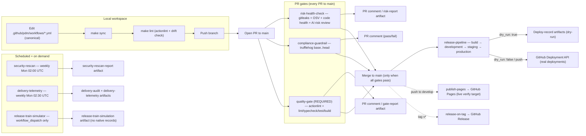

# AI-Augmented Fintech Delivery Engine

A comprehensive reference implementation for modern Product Delivery Management (PDM). This project demonstrates how to rescue complex product launches by combining agile release trains, trunk-based development, shift-left compliance, and automated GitHub Action runners powered by AI agents to eliminate operational friction and ensure predictable, on-time delivery.

## Overview

This repository serves as a reference implementation for modern Product Delivery Management. It demonstrates how to combine trunk-based development, automated shift-left compliance, and AI-driven risk mitigation to eliminate operational friction and ensure predictable, on-time product releases.

## Repository Structure

All PDM workflow and deployment material is consolidated under a single folder, `.github/pdm/`:

> **Note:** "PDM" here means Product Delivery Management, not the Python package manager.

- `.github/pdm/workflows/` - Canonical workflow definitions (source of truth).
  - `risk-health-check.yml` - Automates PR size tracking, code complexity analysis, and PDM risk reporting.
  - `compliance-guardrail.yml` - Enforces shift-left security scans and secret detection before code merges.
  - `quality-gate.yml` - Required status check: actionlint on workflows + toolchain-driven lint/test/build, aggregated into a single branch-protection gate.
  - `release-pipeline.yml` - Promotes builds through development/staging/production environments and records dry-run deployments.
  - `delivery-telemetry.yml` - Exports the GitHub-native delivery audit trail and DORA-style telemetry as run artifacts (weekly + on demand).
- `.github/pdm/deployments/` - Dry-run deployment records uploaded as run artifacts by the release pipeline (not committed).
- `.github/pdm/reports/` - Risk and quality-gate reports uploaded as run artifacts (not committed).
- `.github/workflows/` - Mirrored execution copies of `.github/pdm/workflows/`. GitHub only executes workflows from this directory, so keep the copies in sync with `make sync`.
- `frontend/` - Next.js 16 website (App Router, TypeScript, Tailwind v4) — a dark fintech landing page with Vitest unit + component tests. This is the application the delivery gates exercise.

## System Flow

A high-level view of how the engine flows from local edits through the PR gates, the release pipeline, and telemetry. For the detailed workflow map (triggers, jobs, permissions, artifacts), see `docs/architecture.md`.



Notes on the flow:

- `quality-gate` is the single required branch-protection check on `main` — a PR merges only when all three PR workflows pass.
- On PR runs, workflows post comments to the PR; on non-PR (`workflow_dispatch`) runs they upload reports and dry-run deployment records as run artifacts instead.
- The canonical source of truth is `.github/pdm/workflows/`; `.github/workflows/` holds byte-identical execution copies kept in sync via `make sync`.
- A `push` to `main` always runs the release pipeline for real (`dry_run: false`); `workflow_dispatch` defaults to `dry_run: true`. Staging and production require manual approval.

## Prerequisites

- [actionlint](https://github.com/rhysd/actionlint) installed (`brew install actionlint`) for `make lint`.
- The [GitHub CLI](https://cli.github.com/) (`gh auth login`) for the native PR verification loop.
- [pnpm](https://pnpm.io/) (`brew install pnpm`) for `make test-frontend` (or corepack on Node <25).
- Push access to the repository (workflows run on GitHub, not locally).

## Testing (GitHub native)

Workflows are verified by running them on GitHub — no local Docker/`act` harness:

1. Edit only `.github/pdm/workflows/`, then mirror and validate:
   ```bash
   make sync   # copy canonical workflows to .github/workflows/
   make lint   # actionlint + drift check against the copies
   ```
2. Open a PR to `main` (or `make test-gh` to push + open/update the PR for the current branch). GitHub runs the PDM workflows natively:
   - `quality-gate` (actionlint + lint/typecheck/test/build) — required check
   - `risk-health-check` (gitleaks + OSV + code health) — posts a PR comment
   - `compliance-guardrail` (trufflehog) — posts a PR comment
3. For non-PR runs (`workflow_dispatch`), reports and dry-run deployment records are uploaded as run artifacts instead of PR comments — download them from the run's "Artifacts" section.

`push` to `main` also triggers `release-pipeline` (real `createDeployment`); `workflow_dispatch` defaults to `dry_run: true` so manual runs skip the Deployment API.

## Frontend Testing

The frontend in `frontend/` is developed test-first (Vitest) and verified with a native, container-free target that mirrors the PDM quality gate:

```bash
cd frontend && pnpm test:watch   # fast local TDD loop (Vitest watch)
make test-frontend               # CI-parity: install + lint + typecheck + test + build
```

The `quality-gate` and `risk-health-check` workflows run the same suite (`pnpm install --frozen-lockfile` + lint/typecheck/test/build) against `frontend/` on every pull request.

See `docs/ROADMAP.md` for the full delivery-engine roadmap and phase breakdown.

## Documentation Shortcuts

- [docs/architecture.md](docs/architecture.md) — workflow map, PR-gate pipeline diagram, promotion chain, canonical/mirror layout.
- [docs/local-runbook.md](docs/local-runbook.md) — Native Runbook: testing the delivery engine on GitHub (`make sync`/`lint`/`test-gh`, `workflow_dispatch`, troubleshooting).
- [docs/agents-guide.md](docs/agents-guide.md) — contributor and agent guide (extended `AGENTS.md` with the hard-earned gotchas).
- [docs/decisions/](docs/decisions/) — ADR decision log for the delivery engine.
- [docs/ROADMAP.md](docs/ROADMAP.md) — full delivery-engine roadmap and phase breakdown.
