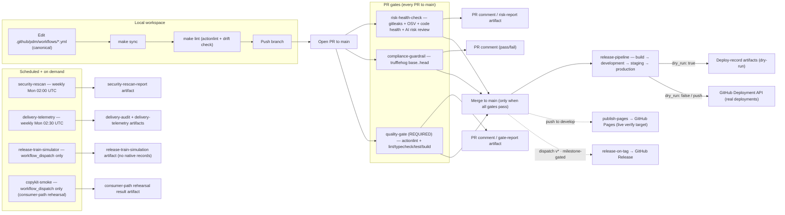

# AI-Augmented Fintech Delivery Engine

A comprehensive reference implementation for modern Product Delivery Management (PDM). This project demonstrates how to rescue complex product launches by combining agile release trains, trunk-based development, shift-left compliance, and automated GitHub Action runners powered by AI agents to eliminate operational friction and ensure predictable, on-time delivery.

## Overview

This repository serves as a reference implementation for modern Product Delivery Management. It demonstrates how to combine trunk-based development, automated shift-left compliance, and AI-driven risk mitigation to eliminate operational friction and ensure predictable, on-time product releases.

## Current State

The delivery engine is **live and operating at cadence** — Phases 0–18 complete, no open gaps:

- **10 canonical workflows** under `.github/pdm/workflows/` (7 core PR/release gates + `publish-pages` + `release-train-simulator` + `copykit-smoke`), mirrored byte-identically to `.github/workflows/` and verified by `make lint`.
- **Releases**: `v0.1.0`, `v0.2.0`, `v0.3.0` shipped via the milestone-gated `release-on-tag` pipeline. Train 2 (departs 08-31, cutoff 08-28) is pending — `v0.3.0` published early, inside train 1's window, so the on-time signal honestly stays 1/1 until a release publishes inside train 2's window `[08-31, 09-14)` (ADR 0009).
- **Latest truthing readout** (P16-T4, 90d window, run 32115287697): deployment frequency dev 1.79/wk · staging/prod 1.56/wk · pages 2.88/wk; lead time median **6m** (11 PRs); change-failure rate **1.0%** (1/100 — the P10-T2 drill event only); MTTR proxy median **7h 15m** (1 event). Full readouts and history: see the [wiki ROADMAP](https://github.com/frdrpo/learning-pdm-fintech-delivery-engine/wiki/ROADMAP).
- **Release train**: 14-day cadence (ADR 0009); train 3 departs **09-14** (cutoff 09-11), train 4 departs 09-28 — see the [Release Train Calendar](https://github.com/frdrpo/learning-pdm-fintech-delivery-engine/wiki/Release-Train-Calendar).
- **Branch topology**: `develop` (default, integration) + `main` (protected; requires the `PDM Quality Gate (Status Check)`). Feature/track branches land via PRs to `develop`; workflow verification runs through `make test-gh` PRs to `main`.

## Repository Structure

All PDM workflow and deployment material is consolidated under a single folder, `.github/pdm/`:

> **Note:** "PDM" here means Product Delivery Management, not the Python package manager.

- `.github/pdm/workflows/` - Canonical workflow definitions (source of truth).
  - `risk-health-check.yml` - Automates PR size tracking, code complexity analysis, and PDM risk reporting.
  - `compliance-guardrail.yml` - Enforces shift-left security scans and secret detection before code merges.
  - `quality-gate.yml` - Required status check: actionlint on workflows + toolchain-driven lint/test/build, aggregated into a single branch-protection gate.
  - `release-pipeline.yml` - Promotes builds through development/staging/production environments and records dry-run deployments.
  - `delivery-telemetry.yml` - Exports the GitHub-native delivery audit trail and DORA-style telemetry as run artifacts (weekly + on demand).
  - `security-rescan.yml` - Weekly + on-demand gitleaks/OSV re-scan; uploads a report artifact and files an issue on blocking schedule findings.
  - `release-on-tag.yml` - Milestone-gated releases: `workflow_dispatch` with a `version` (or a `v*` tag push) cuts the release off `develop` — requires a closed `v<version>` milestone, bumps `frontend/package.json`, and creates the GitHub Release in one self-contained run.
  - `publish-pages.yml` - Publishes the static-exported frontend to GitHub Pages on every push to `develop` (the live `DEPLOY_VERIFY_URL` target).
  - `release-train-simulator.yml` - Runs the deterministic release-train model headlessly (`workflow_dispatch` only); labeled artifacts, never native records (ADR 0010).
  - `copykit-smoke.yml` - P17 copy-kit rehearsal: replays the engine copy-kit (§1→§8) in a throwaway consumer workspace on a fresh runner (`workflow_dispatch` only; local equivalent `make test-consumer-path`).
- `.github/pdm/deployments/` - Dry-run deployment records uploaded as run artifacts by the release pipeline (not committed).
- `.github/pdm/reports/` - Risk and quality-gate reports uploaded as run artifacts (not committed).
- `.github/workflows/` - Mirrored execution copies of `.github/pdm/workflows/`. GitHub only executes workflows from this directory, so keep the copies in sync with `make sync`.
- `frontend/` - Next.js 16 website (App Router, TypeScript, Tailwind v4) — a dark fintech landing page with Vitest unit + component tests. This is the application the delivery gates exercise.

## System Flow

A high-level view of how the engine flows from local edits through the PR gates, the release pipeline, and telemetry. For the detailed workflow map (triggers, jobs, permissions, artifacts), see the [Architecture](https://github.com/frdrpo/learning-pdm-fintech-delivery-engine/wiki/Architecture) wiki page (or the tracked mirror `docs/architecture.md`).



Notes on the flow:

- `quality-gate` is the single required branch-protection check on `main` — a PR merges only when all three PR workflows pass.
- On PR runs, workflows post comments to the PR; on non-PR (`workflow_dispatch`) runs they upload reports and dry-run deployment records as run artifacts instead.
- The canonical source of truth is `.github/pdm/workflows/`; `.github/workflows/` holds byte-identical execution copies kept in sync via `make sync`.
- A `push` to `main` always runs the release pipeline for real (`dry_run: false`); `workflow_dispatch` defaults to `dry_run: true`. Staging and production require manual approval.
- Releases are cut from `develop` via `release-on-tag` `workflow_dispatch` (version input): gated on a closed milestone `v<version>`, bumps `frontend/package.json` on `develop`, and creates the GitHub Release in the same run (`GITHUB_TOKEN`-triggered events never spawn a new run, so no tag-push chaining). Manual `v*` tag pushes still publish but pass the same milestone gate.

## Prerequisites

- [actionlint](https://github.com/rhysd/actionlint) installed (`brew install actionlint`) for `make lint`.
- The [GitHub CLI](https://cli.github.com/) (`gh auth login`) for the native PR verification loop.
- [pnpm](https://pnpm.io/) (`brew install pnpm`) for `make test-frontend` (or corepack on Node <25).
- Push access to the repository (workflows run on GitHub, not locally).

## Makefile Targets

The `Makefile` is the local operator surface for the engine. All targets run natively (no Docker required):

| Target | What it does |
|---|---|
| `make sync` | Mirror `.github/pdm/workflows/*.yml` (canonical) → `.github/workflows/` (GitHub executes only there) |
| `make lint` | actionlint on canonical + execution copies, then a drift check that fails if the two trees differ |
| `make sync-deps` | Adopt dependabot version bumps from `.github/workflows/` back into canonical (then `make sync`) |
| `make test-frontend` | CI-parity frontend suite: install + lint + typecheck + test + build (pnpm) |
| `make test-gh` | Push current branch + open/update a PR to `main`, then `gh pr checks --watch` the native gate runs |
| `make test-consumer-path` | P17 copy-kit rehearsal: execute kit §1→§8 in a throwaway consumer workspace (`scripts/consumer-smoke.mjs`) |
| `make topology-check` | Verify the documented repo topology against the live repo (`scripts/wire-topology.mjs --check`) |
| `make topology-apply` | Converge the topology (branch protection, environments, Pages, `DEPLOY_VERIFY_URL`) |

## Testing (GitHub native)

Workflows are verified by running them on GitHub — no local Docker/`act` harness:

1. Edit only `.github/pdm/workflows/`, then mirror and validate:
   ```bash
   make sync   # copy canonical workflows to .github/workflows/
   make lint   # actionlint + drift check against the copies
   ```
2. Open a PR to `main` (or `make test-gh` to push + open/update the PR for the current branch). GitHub runs the PDM workflows natively:
   - `quality-gate` (actionlint + lint/typecheck/test/build) — required check
   - `risk-health-check` (gitleaks + OSV + code health) — posts a PR comment
   - `compliance-guardrail` (trufflehog) — posts a PR comment
3. For non-PR runs (`workflow_dispatch`), reports and dry-run deployment records are uploaded as run artifacts instead of PR comments — download them from the run's "Artifacts" section.

`push` to `main` also triggers `release-pipeline` (real `createDeployment`); `workflow_dispatch` defaults to `dry_run: true` so manual runs skip the Deployment API.

## Frontend Testing

The frontend in `frontend/` is developed test-first (Vitest) and verified with a native, container-free target that mirrors the PDM quality gate:

```bash
cd frontend && pnpm test:watch   # fast local TDD loop (Vitest watch)
make test-frontend               # CI-parity: install + lint + typecheck + test + build
```

The `quality-gate` and `risk-health-check` workflows run the same suite (`pnpm install --frozen-lockfile` + lint/typecheck/test/build) against `frontend/` on every pull request.

See the [wiki ROADMAP](https://github.com/frdrpo/learning-pdm-fintech-delivery-engine/wiki/ROADMAP) for the full delivery-engine roadmap and phase breakdown.

## Documentation

The **project wiki** is the canonical, always-current docs home (since the 2026-08-18 docs migration):

- [Wiki Home](https://github.com/frdrpo/learning-pdm-fintech-delivery-engine/wiki/Home) — start here; also [Overview](https://github.com/frdrpo/learning-pdm-fintech-delivery-engine/wiki/Overview) and [Glossary](https://github.com/frdrpo/learning-pdm-fintech-delivery-engine/wiki/Glossary).
- [ROADMAP](https://github.com/frdrpo/learning-pdm-fintech-delivery-engine/wiki/ROADMAP) — full delivery-engine roadmap and phase breakdown (current: Phases 0–18 complete, 19–21 planned).
- [Architecture](https://github.com/frdrpo/learning-pdm-fintech-delivery-engine/wiki/Architecture) — workflow map, PR-gate pipeline diagram, promotion chain, canonical/mirror layout.
- [Local-Runbook](https://github.com/frdrpo/learning-pdm-fintech-delivery-engine/wiki/Local-Runbook) — Native Runbook: testing the delivery engine on GitHub (`make sync`/`lint`/`test-gh`, `workflow_dispatch`, troubleshooting).
- [Agent-Guide](https://github.com/frdrpo/learning-pdm-fintech-delivery-engine/wiki/Agent-Guide) — contributor and agent guide (extended `AGENTS.md` with the hard-earned gotchas).
- [Decision-Log](https://github.com/frdrpo/learning-pdm-fintech-delivery-engine/wiki/Decision-Log) — ADR decision log for the delivery engine (ADR 0001–0011).

The repo also tracks a **committed mirror under `docs/`** (kept in sync with the wiki) for offline/PR review:

- [docs/architecture.md](docs/architecture.md) · [docs/local-runbook.md](docs/local-runbook.md) · [docs/agents-guide.md](docs/agents-guide.md) · [docs/decisions/](docs/decisions/) · [docs/ROADMAP.md](docs/ROADMAP.md)
